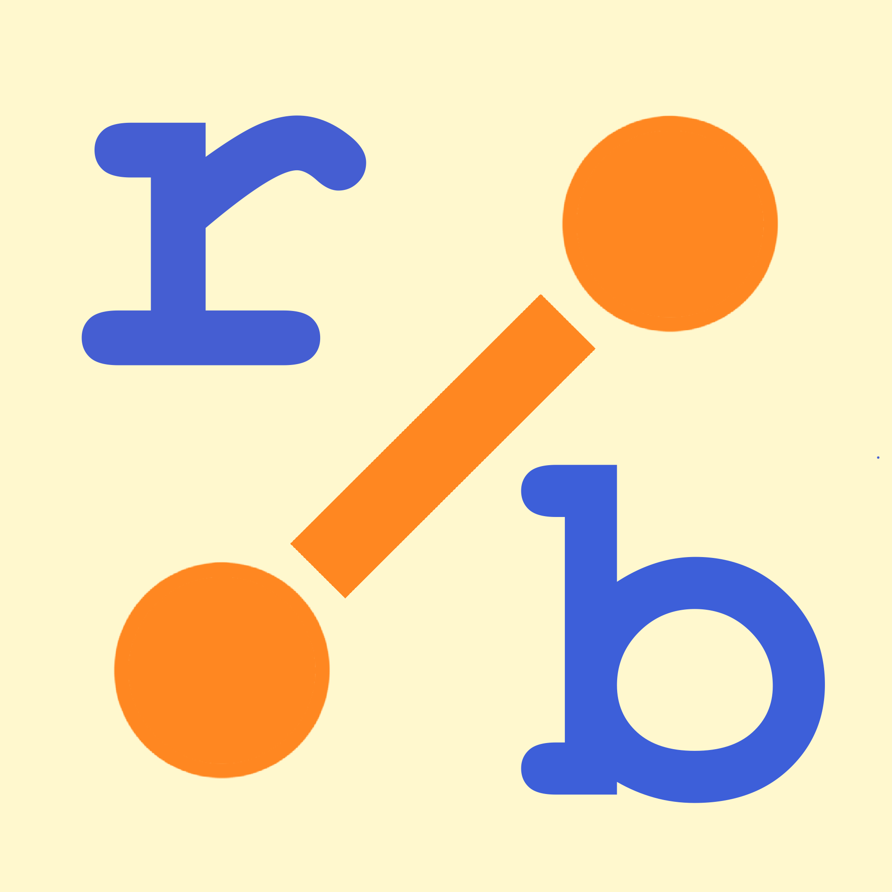
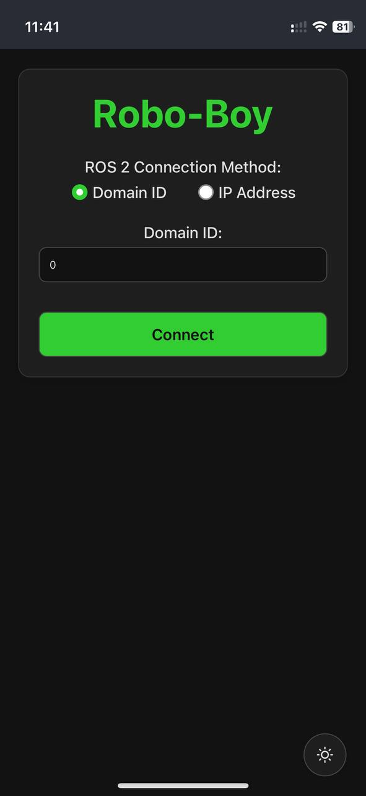
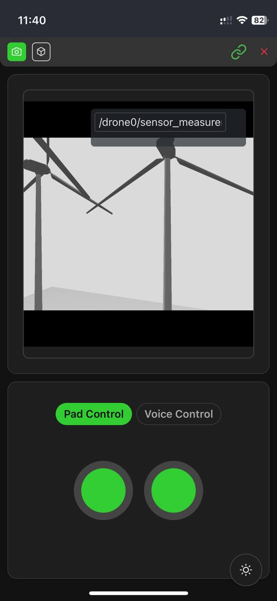
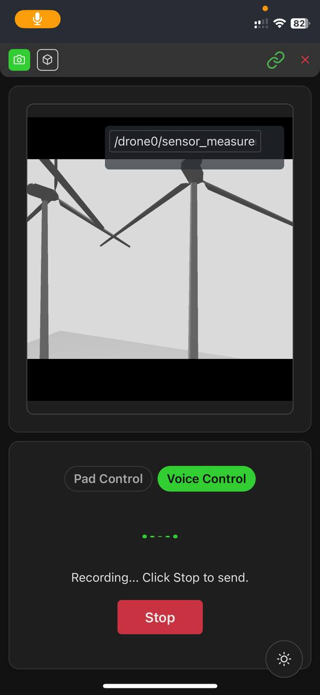
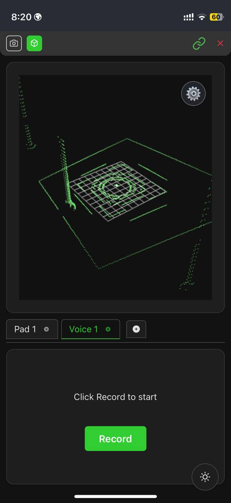
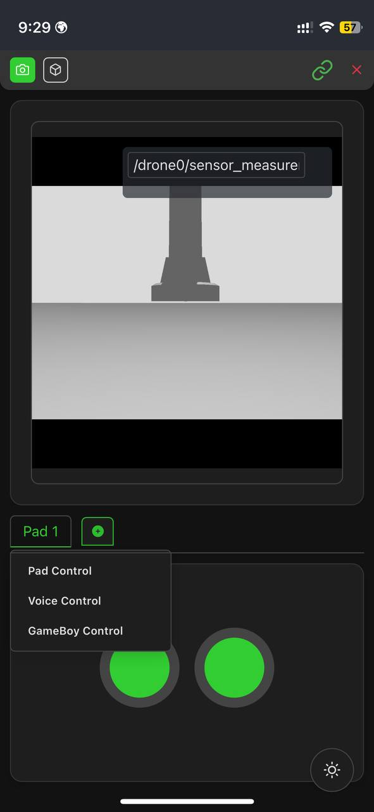
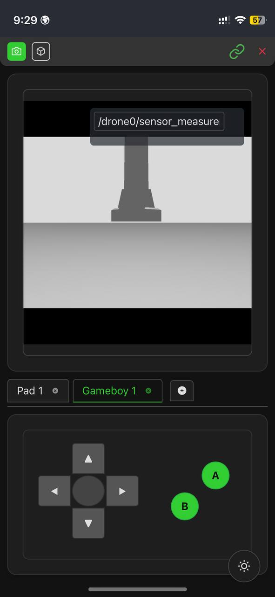
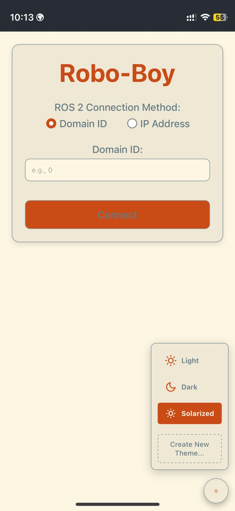
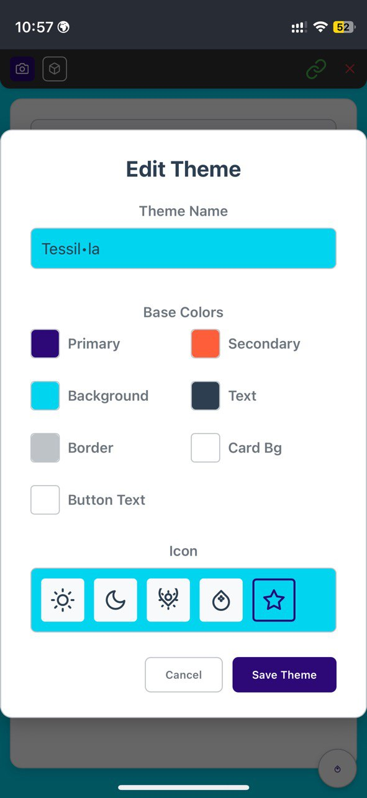
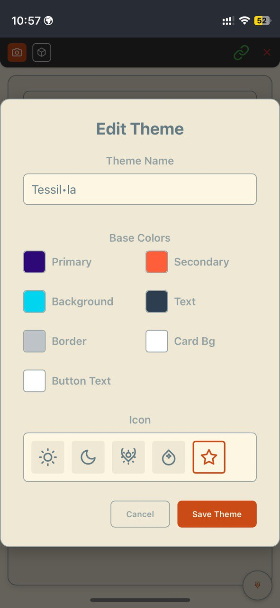

# 🤖 Robo-Boy

<!-- Replace with actual logo path if different -->
<p align="center">
  
</p>

A vibe web application for controlling ROS 2 robots, featuring a React frontend, ROS 2 integration via rosbridge, and secure local development setup with Caddy and HTTPS. Inspired by retro handheld consoles.

## ✨ Features

*   📱 Responsive design for desktop and mobile.
*   🔗 ROS 2 connection (via rosbridge).
*   📷 Camera stream display (via web_video_server).
*   🦊 Foxglove WebSocket server for advanced data visualization and debugging.
*   🕹️ Interchangeable control interfaces:
    * Standard gamepad with dual joysticks (`sensor_msgs/Joy`)
    * Retro GameBoy-style control layout
    * Voice control input with recording animation
*   🧊 3D visualization support (using ros3djs).
    * 🌈 Customizable point cloud rendering with options for:
      * Point size adjustment
      * Color selection (fixed or gradient based on x/y/z axis)
      * Maximum points setting
*   🌗 Animated Light/Dark mode toggle.
*   🎨 Customizable themes with user-created color palettes.
*   🛡️ Local HTTPS development setup via Caddy and mkcert.

## 🖼️ Screenshot

<!-- Replace with actual paths if different -->
<p align="center">
  
  
  
  
  
  
  
</p>

## 🎮 Control Interfaces

The application provides multiple control interfaces that can be swapped during runtime:

### Standard Gamepad
A dual-joystick layout for precise control, publishing to the `/joy` topic with ROS standard `sensor_msgs/Joy` messages.

### GameBoy Layout
A nostalgic GameBoy-inspired control interface with D-pad and A/B buttons.

### Voice Control
Record voice commands that can be sent to your robot for voice-activated control.

You can open multiple control panels and switch between them with tabs.

## 3D Visualization

The application includes a powerful 3D viewer for ROS topics, with customizable visualization settings.

### Point Cloud Visualization

You can add point cloud visualizations to the 3D viewer and customize their appearance:

1. Click the ⚙️ (settings) button in the bottom right of the 3D panel
2. In the settings popup, click "Add Visualization"
3. Select "Pointcloud" as the visualization type, then choose a valid point cloud topic
4. Once added, a settings button (⚙️) appears next to each point cloud visualization
5. Click this button to access point cloud-specific settings:
   - **Point Size**: Adjust the size of individual points
   - **Max Points**: Control the maximum number of points to display
   - **Color Options**:
     - Fixed color mode: Select any color for the entire point cloud
     - Axis-based gradient: Color points according to their position along the X, Y, or Z axis
     - Custom color gradients: Define the minimum and maximum colors for the gradient

These visualization settings help optimize performance and highlight important features in your point cloud data.

## Theme Customization

The application supports multiple themes, including user-created custom themes. Themes define the color palette for the UI elements.

### Creating & Managing Themes

1.  **Access Theme Menu:** Click the theme icon button (usually in the bottom-right corner). This opens a popup menu displaying available themes (default and custom).
2.  **Create New Theme:** Click the "Create New Theme..." button in the popup. This opens the Theme Creator modal.
3.  **Define Theme:**
    *   Enter a unique **Name** for your theme.
    *   Select the base **Colors** (Primary, Secondary, Background) using the color pickers. Optional colors (Text, Border, etc.) can also be set.
    *   Choose an **Icon** to represent your theme in the selector menu.
    *   Click **Save Theme**.

4.  **Editing/Deleting:** Custom themes will have Edit (pencil) and Delete (trash) icons next to them in the theme selector popup. Clicking Edit opens the Theme Creator pre-filled with that theme's settings. Clicking Delete prompts for confirmation before removing the theme.

    <p align="center">
      
        
        
    </p>


### How it Works

*   Default themes (`light`, `dark`, `solarized`) have their CSS variables defined directly in `src/index.css` using `[data-theme="themename"]` selectors.
*   Custom themes are stored in the browser's `localStorage`.
*   When a custom theme is selected, JavaScript dynamically generates a `<style>` tag containing CSS variable overrides based on the saved colors and injects it into the document head. The `<body>` element also gets a `data-theme="custom-theme-id"` attribute.
*   UI components should primarily use the defined CSS variables (e.g., `var(--primary-color)`, `var(--background-color)`) for styling to ensure they adapt correctly to the selected theme. 

## 🧩 Codebase Organization

The codebase follows a component-based architecture:

- `/src/components` - Main UI components
- `/src/components/gamepads` - All gamepad control interfaces
  - `/standard` - Standard dual joystick layout
  - `/gameboy` - GameBoy-style control layout  
  - `/voice` - Voice control interface
- `/src/hooks` - Custom React hooks including ROS connection
- `/src/utils` - Utility functions and helpers
- `/src/features` - Feature-specific code (e.g., theme system)
- `/src/types` - TypeScript type definitions

### Adding Custom Gamepad Layouts

See the dedicated README in the `/src/components/gamepads` directory for instructions on creating custom control interfaces.

## 🚀 Getting Started

### Prerequisites

*   [Docker](https://docs.docker.com/get-docker/) and [Docker Compose](https://docs.docker.com/compose/install/) installed.
*   [Node.js](https://nodejs.org/) (v18 LTS or later recommended) and npm. (*Note: Node/npm are technically only needed if modifying dependencies locally before a Docker build, but good to have.*)
*   [mkcert](https://github.com/FiloSottile/mkcert#installation) for local HTTPS setup.

### Local Development Setup

1.  **Clone the Repository:**
    ```bash
    git clone <your-repository-url>
    cd robo-boy # Or your actual directory name
    ```

2.  **Setup Local HTTPS with mkcert:**
    *   **Install mkcert's CA:** Run this once per machine to make browsers trust local certificates.
        ```bash
        mkcert -install 
        ```
        *(You might need `sudo` or administrator privileges)*
    *   **Create Certificates Directory:**
        ```bash
        mkdir certs
        ```
    *   **Generate Certificate:** Replace `YOUR_HOST_IP` with your computer's actual local network IP address (e.g., `192.168.1.67`). This certificate will be valid for `localhost` and your IP.
        ```bash
        mkcert -key-file certs/local-key.pem -cert-file certs/local-cert.pem localhost 127.0.0.1 ::1 YOUR_HOST_IP
        ```

3.  **Build and Run Services:** This command builds the Docker images (if they don't exist or need updating) and starts the `app` (React Vite dev server), `ros-stack` (rosbridge, web_video_server), and `caddy` (reverse proxy) containers.
    ```bash
    docker compose up -d --build
    ```

4.  **Access the Application:**
    *   On your development machine: `https://localhost`
    *   From another device on the same network (e.g., mobile): `https://YOUR_HOST_IP` (using the same IP you used for `mkcert`)

### Stopping the Services

```bash
# Stop and remove containers
docker compose down

# Stop, remove containers, AND remove Caddy's data volumes (useful for a clean restart)
docker compose down -v 
```

## 🐳 Services Overview

*   **`app`**: Runs the Vite development server for the React frontend with hot-reloading.
    *   Accessible *internally* at `http://app:5173`.
*   **`ros-stack`**: Runs ROS 2 components.
    *   `rosbridge_server`: Provides WebSocket connection at `ws://ros-stack:9090`.
    *   `web_video_server`: Streams video topics over HTTP at `http://ros-stack:8080`.
    *   `foxglove_bridge`: Provides WebSocket connection for Foxglove Studio at `ws://ros-stack:8765`.
*   **`caddy`**: Acts as a reverse proxy.
    *   Listens on host ports `80` and `443`.
    *   Provides HTTPS using the generated `mkcert` certificates.
    *   Routes `/websocket` requests to `ros-stack:9090`.
    *   Routes `/foxglove` requests to `ros-stack:8765`.
    *   Routes all other requests to the Vite dev server (`app:5173`).

## 🦊 Foxglove Studio Integration

The application includes a Foxglove WebSocket server that allows you to connect and visualize your ROS data using [Foxglove Studio](https://foxglove.dev/studio). This provides advanced data visualization, plotting, and debugging capabilities.

### Connecting to Foxglove Studio

1. Launch Foxglove Studio (web or desktop version)
2. Click "Open Connection" and select "WebSocket"
3. Enter one of the following URLs:
   - Local machine: `ws://localhost:8765` (direct connection to the port)
   - Local machine via Caddy proxy: `wss://localhost/foxglove`
   - From another device on the same network: `wss://YOUR_HOST_IP/foxglove`
4. Click "Open"

You should now be connected to the ROS environment and can use all of Foxglove Studio's features to visualize and analyze your robot's data.

## 🛠️ Development Notes

*   Changes to frontend code (in `/src`) should trigger hot-reloading in the browser.
*   If you modify `Dockerfile`, `docker-compose.yml`, or `Caddyfile`, you'll need to rebuild and restart the services (`docker compose up -d --build --force-recreate`).
*   Caddy logs can be viewed with `docker compose logs caddy`.
*   ROS stack logs can be viewed with `docker compose logs ros-stack`.

## PWA Configuration and Icons

### Setting Up PWA Icons

For the PWA to properly install on devices, specific icon sizes are required. The application uses the following icon sizes:

1. **Favicon sizes**: 16x16, 32x32, 48x48, 64x64
2. **Standard PWA icons**: 72x72, 96x96, 128x128, 144x144, 152x152, 192x192, 384x384, 512x512
3. **Special icons**:
   - Apple Touch Icon: 180x180
   - Maskable Icon: 512x512 (with 10% padding on all sides for safe area)

### Generating Icons

You can generate these icons in one of these ways:

#### Option 1: Using ImageMagick (Recommended)

If you have [ImageMagick](https://imagemagick.org/) installed:

1. Run the PowerShell script: `powershell -ExecutionPolicy Bypass -File generate-icons.ps1`
2. This will generate all required icon sizes in the `public/images/` directory

#### Option 2: Manual Generation

If you don't have ImageMagick:

1. Use an image editor like Photoshop, GIMP, or an online tool
2. Create resized versions of `images/logo.png` at all sizes listed above
3. Save them in the `public/images/` directory with the following naming convention:
   - Small sizes: `favicon-16x16.png`, `favicon-32x32.png`, etc.
   - Standard sizes: `icon-72x72.png`, `icon-96x96.png`, etc.
   - PWA specific: `pwa-192x192.png`, `pwa-512x512.png`
   - Special: `apple-touch-icon.png`, `maskable-icon-512x512.png` (with padding)

#### Option 3: Online PWA Icon Generators

Use online tools that can generate all the required sizes from your source image:

- [PWA Builder](https://www.pwabuilder.com/imageGenerator)
- [App Icon Generator](https://appicon.co/)
- [Favicon Generator](https://realfavicongenerator.net/)

After generating icons, place them in the `public/images/` directory.

### Manifest Configuration

The PWA configuration is handled by:

1. `manifest.webmanifest` - Contains the main PWA configuration including icon references
2. `vite.config.ts` - Contains the build-time PWA plugin configuration
3. `index.html` - Contains favicon and Apple touch icon references

**Note**: After changing icon files, make sure to clean your browser cache or use incognito mode to test the PWA installation with the new icons.

```
