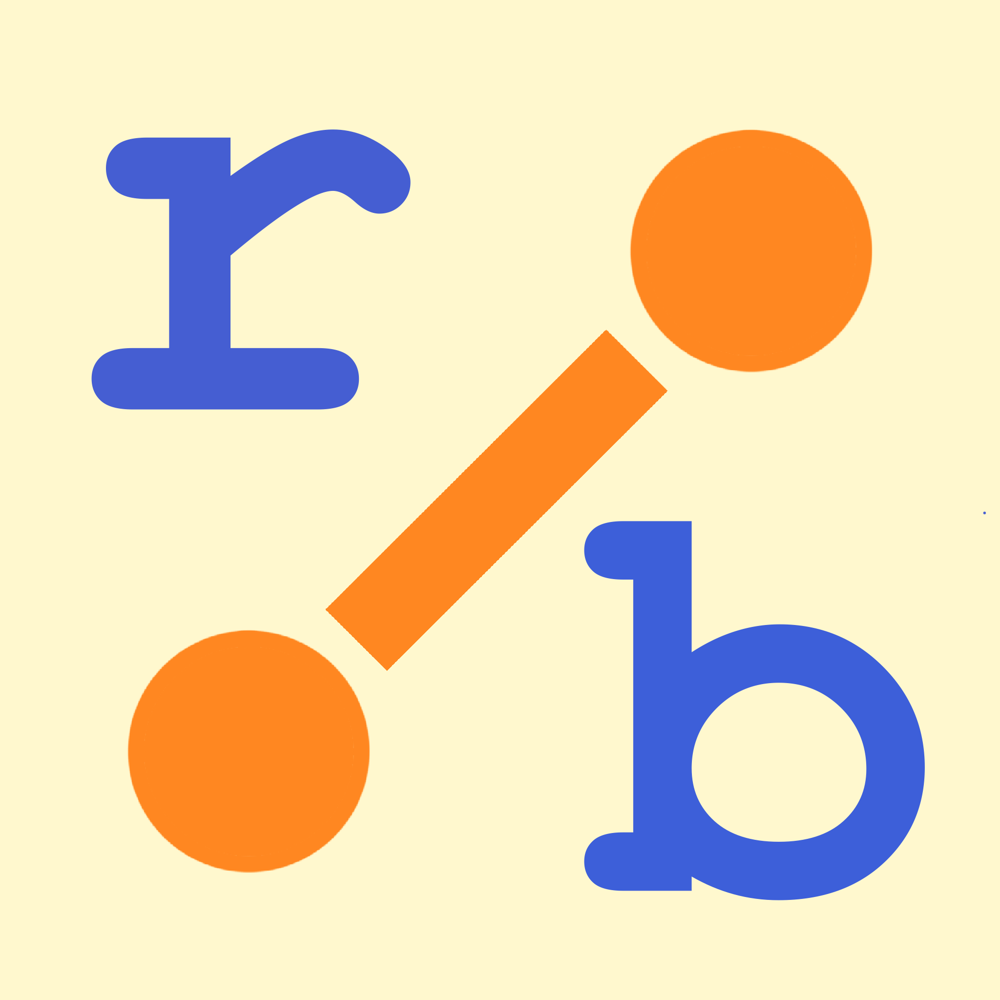

# Robo-Boy

[](https://github.com/tessel-la/robo-boy/actions/workflows/test.yml)
[](https://github.com/tessel-la/robo-boy/actions/workflows/docker-ci.yml)

<p align="center">
  
</p>

A web application for controlling ROS 2 robots, featuring a React frontend, ROS 2 integration via rosbridge, and secure local development setup with Caddy and HTTPS. Inspired by retro handheld consoles.

## Features

- Responsive design for desktop and mobile
- ROS 2 connection (via rosbridge)
- Camera stream display (via web_video_server)
- User-created control pads with reusable starter templates
- 3D visualization support
- Behavior tree editing with searchable nodes and ROS resources
- Customizable themes with user-created color palettes

## App Demo

<div align="center">
  <video src="https://github.com/user-attachments/assets/36b90514-79a6-42c4-9a92-b5231c9d16f3" width="50%" controls></video>
</div>

## Getting Started

<details>
<summary><strong>Prerequisites</strong></summary>

- [Docker](https://docs.docker.com/get-docker/) and [Docker Compose](https://docs.docker.com/compose/install/) installed.
- [mkcert](https://github.com/FiloSottile/mkcert#installation) for local HTTPS setup.
</details>

<details>
<summary><strong>Local Development Setup</strong></summary>

1.  **Clone the Repository:**

    ```bash
    git clone git@github.com:tessel-la/robo-boy.git
    cd robo-boy
    ```

2.  **Setup Local HTTPS with mkcert:**
    - **Install mkcert's CA:** Run this once per machine to make browsers trust local certificates.
      ```bash
      mkcert -install
      ```
      _(You might need `sudo` or administrator privileges)_
    - **Create Certificates Directory:**
      ```bash
      mkdir certs
      ```
    - **Generate Certificate:** Replace `YOUR_HOST_IP` with your computer's actual local network IP address (e.g., `192.168.1.67`). This certificate will be valid for `localhost` and your IP.
      ```bash
      mkcert -key-file certs/local-key.pem -cert-file certs/local-cert.pem localhost 127.0.0.1 ::1 YOUR_HOST_IP
      ```

3.  **Build and Run Services:** This command builds the Docker images (if they don't exist or need updating) and starts the `app` (React Vite dev server), `ros-stack` (rosbridge and web_video_server), and `caddy` (reverse proxy) containers.

    ```bash
    docker compose up -d --build
    ```

4.  **Access the Application:** On your development machine, open `https://localhost`. From another device on the same network, open `https://YOUR_HOST_IP` using the same IP you used for `mkcert`.
</details>

<details>
<summary><strong>Simulation Workspace Overlays</strong></summary>

The `ros-stack` service runs with `network_mode: host` so it can discover ROS 2 nodes from host-networked simulation containers such as `aerial_sim_cont`, and `manipulator_sim_cont`. To let rosbridge understand custom message, service, and action types from those simulations, mount each built ROS 2 workspace `install` directory under `/overlay_ws/<name>`.

`ros-stack` automatically sources every install workspace mounted under `/overlay_ws`, and still supports the legacy single-workspace mount at `/overlay_ws`. It also supports `ROBOT_WORKSPACE_SETUP=/path/to/install/setup.bash` for workspaces whose generated hooks expect their original path.

Robo-Boy keeps robot-specific mounts in Compose override files. Choose one setup by copying an example `.env`; after that, regular `docker compose up` uses the selected files automatically.

```bash
# No robot-specific overlay
cp .env.no-overlay.example .env

# Aerostack overlay
cp .env.aerostack.example .env

# Manipulator overlay
cp .env.manipulator.example .env
```

When switching overlays, recreate the ROS service so the mounts and sourced workspaces change:

```bash
docker compose up -d --build --force-recreate ros-stack
```

#### Aerostack / aerial-sim

The Aerostack override mounts `~/.aerostack2_install` at `/overlay_ws/aerostack2`. After the Aerostack simulation workspace has been built, copy its install directory from the simulation container and select the Aerostack `.env`:

```bash
docker cp aerial_sim_cont:/root/aerostack2_ws/install ~/.aerostack2_install
cp .env.aerostack.example .env
docker compose up -d --build
```

#### Manipulator simulation

The manipulator simulation stores its Jazzy build cache in Docker volumes named `manipulator-sim_colcon_install_jazzy` and `manipulator-sim_colcon_build_jazzy`, mounted in `manipulator_sim_cont` at `/home/rosuser/moveit_ws/install` and `/home/rosuser/moveit_ws/build`. Because that workspace uses symlinked install files, the Robo-Boy override also mounts the simulation build volume at both `/overlay_ws/build` and `/home/rosuser/moveit_ws/build`, plus the source packages read-only, so custom action definitions resolve correctly.

Start or build the manipulator simulation first, then start Robo-Boy with the optional override:

```bash
cd /home/riccardo/code/manipulator-sim
docker compose up -d --build

cd /home/riccardo/code/robo-boy
cp .env.manipulator.example .env
docker compose up -d --build
```

The override assumes `manipulator-sim` is next to `robo-boy` at `../manipulator-sim`. If it is somewhere else, set `MANIPULATOR_SIM_DIR`:

```bash
cp .env.manipulator.example .env
printf '\nMANIPULATOR_SIM_DIR=/path/to/manipulator-sim\n' >> .env
docker compose up -d --build
```

If Robo-Boy is already running, recreate only the ROS service after selecting the manipulator `.env`:

```bash
docker compose up -d --build --force-recreate ros-stack
```

If your simulator Compose project or volume names differ, set these overrides in `.env`:

```bash
MANIPULATOR_SIM_INSTALL_VOLUME=manipulator-sim_colcon_install_jazzy
MANIPULATOR_SIM_BUILD_VOLUME=manipulator-sim_colcon_build_jazzy
```

You should see overlay activation messages in the ROS stack logs:

```bash
docker compose logs ros-stack
```

#### Custom workspace

For a custom workspace that has an install directory on the host, add a Compose override that mounts it under `/overlay_ws/<name>`:

```yaml
services:
  ros-stack:
    volumes:
      - /path/to/custom_ws/install:/overlay_ws/custom:ro
```

For a workspace stored in a Docker volume, mark the volume as external:

```yaml
services:
  ros-stack:
    volumes:
      - custom_ws_install:/overlay_ws/custom:ro

volumes:
  custom_ws_install:
    external: true
```

Then run Robo-Boy with both Compose files:

```bash
COMPOSE_FILE=docker-compose.yml:docker-compose.custom.yml docker compose up -d --build
```

Make sure the simulation container and `ros-stack` use compatible ROS settings, especially `ROS_DISTRO` and `ROS_DOMAIN_ID`, and that the workspace has been built before mounting its install directory.

If the custom workspace was built with `colcon build --symlink-install`, also mount any build/source paths referenced by generated hooks or symlinks. The manipulator override is the reference pattern for that case.

</details>

<details>
<summary><strong>Stopping the Services</strong></summary>

```bash
# Stop and remove containers
docker compose down

# Stop, remove containers, AND remove Caddy's data volumes (useful for a clean restart)
docker compose down -v
```

</details>

## Control Interfaces & Gamepad Creation

The application starts with an empty control area and lets each user create the pads they need. Pads can be built from scratch or cloned from a starter template.

<details>
<summary><strong>Starter Template</strong></summary>

#### Dual Joystick + Heartbeat

A generic starter pad with two joysticks publishing one four-axis `sensor_msgs/msg/Joy` message on `/joy`, plus a pulse heartbeat monitor on `/heartbeat`. Selecting the template creates an editable user-owned copy.

</details>

<details>
<summary><strong>Custom Gamepad Creator</strong></summary>

**Create your own control interfaces directly in the app!** The Custom Gamepad Creator allows you to design personalized control layouts using a drag-and-drop interface.

**Features:**

- **Component Library**: Choose from joysticks, buttons, D-pads, toggles, and sliders
- **Grid-based Design**: Drag and drop components on a customizable grid
- **Real-time Preview**: Test your gamepad while designing
- **ROS Integration**: Configure each component to publish to specific ROS topics
- **Save & Share**: Store layouts locally and export/import via JSON files

**Getting Started:**

1. Click the "+" button in the control panel tabs
2. Select "Create Custom Gamepad" or choose a template
3. Drag components from the palette to design your layout
4. Configure each component's ROS topic and behavior
5. Save your custom gamepad for future use

Saved pads can be exported individually as versioned JSON files and imported on another device or browser. Imports are added to the custom layout library without opening a control tab.

Perfect for creating specialized control interfaces tailored to your specific robot's needs!

</details>

<details>
<summary><strong>Tab Management</strong></summary>

You can open multiple user-created control panels and switch between them with tabs.

</details>

## Theme Customization

<details>
<summary><strong>Custom Theme Creator</strong></summary>

<div align="center">
  <video src="https://github.com/user-attachments/assets/3f28cc2b-b9e9-46fa-b36c-69324dec5664" width="30%" controls></video>
</div>

The application supports multiple themes, including user-created custom themes. Themes define the color palette for the UI elements.

1.  **Access Theme Menu:** Click the theme icon button (usually in the bottom-right corner). This opens a popup menu displaying available themes (default and custom).
2.  **Create New Theme:** Click the "Create New Theme..." button in the popup. This opens the Theme Creator modal.
3.  **Define Theme:**
    - Enter a unique **Name** for your theme.
    - Select the base **Colors** (Primary, Secondary, Background) using the color pickers. Optional colors (Text, Border, etc.) can also be set.
    - Choose an **Icon** to represent your theme in the selector menu.
    - Click **Save Theme**.
4.  **Editing/Deleting:** Custom themes will have Edit (pencil) and Delete (trash) icons next to them in the theme selector popup. Clicking Edit opens the Theme Creator pre-filled with that theme's settings. Clicking Delete prompts for confirmation before removing the theme.
</details>

<details>
<summary><strong>How Theme System Works</strong></summary>

- Default themes (`light`, `dark`, `solarized`) have their CSS variables defined directly in `src/index.css` using `[data-theme="themename"]` selectors.
- Custom themes are stored in the browser's `localStorage`.
- When a custom theme is selected, JavaScript dynamically generates a `<style>` tag containing CSS variable overrides based on the saved colors and injects it into the document head. The `<body>` element also gets a `data-theme="custom-theme-id"` attribute.
- UI components should primarily use the defined CSS variables (e.g., `var(--primary-color)`, `var(--background-color)`) for styling to ensure they adapt correctly to the selected theme.
</details>

## Development Notes

<details>
<summary><strong>Development Tips</strong></summary>

- Changes to frontend code (in `/src`) should trigger hot-reloading in the browser.
- If you modify `Dockerfile`, `docker-compose.yml`, or `Caddyfile`, you'll need to rebuild and restart the services (`docker compose up -d --build --force-recreate`).
- Caddy logs can be viewed with `docker compose logs caddy`.
- ROS stack logs can be viewed with `docker compose logs ros-stack`.
</details>

## Testing

The project is enforcing high code quality standards with strict coverage thresholds (>20% for Statements, Branches, Functions, and Lines).

<details>
<summary><strong>Unit Tests</strong></summary>

Unit tests are built with **Vitest**. They are co-located with source files (e.g., `src/hooks/useRos.ts` -> `src/hooks/useRos.test.ts`).

```bash
# Run unit tests in watch mode (for development)
npm run test

# Run unit tests once (for CI/CD)
npm run test:run

# Generate coverage report
npm run test:coverage
```

</details>

<details>
<summary><strong>End-to-End (E2E) Tests</strong></summary>

End-to-End tests are built with **Playwright**. They verify the full application flow in a real browser environment.

```bash
# Run all E2E tests (headless)
npm run e2e

# Run against the Docker/Caddy stack that is already up on localhost
npm run e2e:stack

# Run E2E tests with UI runner (interactive debugging)
npm run e2e:ui

# View the last E2E test report
npm run e2e:report
```

</details>

## Codebase Organization

<details>
<summary><strong>Project Structure</strong></summary>

The codebase follows a component-based architecture:

- `/e2e` - End-to-End tests (Playwright)
  - `app-navigation.spec.ts` - Navigation and routing tests
  - `entry-page.spec.ts` - Entry page interaction tests
- `/src/components` - Main UI components and layouts
  - Core UI components: `MainControlView`, `VisualizationPanel`, `Navbar`, `SettingsPopup`, etc.
  - `/gamepads/custom` - Runtime wrapper for user-created gamepads
  - `/visualizers` - React wrappers for 3D visualization
    - `PointCloudViz.tsx` - Point cloud visualization component
    - `LaserScanViz.tsx` - Laser scan visualization component
    - `PoseStampedViz.tsx` - Pose/Odometry visualization component
    - `UrdfViz.tsx` - URDF model visualization component
    - `CameraInfoViz.tsx` - Camera information display
- `/src/features` - Feature-specific code organized by functionality
  - `/theme` - Theme system with custom color palette creation
  - `/customGamepad` - **Custom Gamepad Creator System**
    - `types.ts` - TypeScript interfaces and component definitions
    - `defaultLayouts.ts` - Pre-built layouts and component library
    - `gamepadStorage.ts` - Local storage management for custom layouts
    - `/components` - Custom gamepad editor and component implementations
      - `GamepadEditor.tsx` - Main drag-and-drop editor interface
      - `CustomGamepadLayout.tsx` - Runtime layout renderer
      - `GamepadComponent.tsx` - Generic component wrapper
      - `JoystickComponent.tsx`, `ButtonComponent.tsx`, `DPadComponent.tsx`
      - `ToggleComponent.tsx`, `SliderComponent.tsx` - Input components
- `/src/hooks` - Custom React hooks (`useRos.ts`, `useRos3d.ts`, etc.)
- `/src/utils` - Utility functions and helpers
  - `/ros3d` - Core ROS 3D logic and primitive definitions
    - `/visualizers` - Pure logic for PointCloud, LaserScan, etc.
- `/src/types` - TypeScript type definitions
- `vitest.config.ts` - Unit test configuration
- `playwright.config.ts` - E2E test configuration
</details>

<details>
<summary><strong>Adding Custom Gamepad Layouts</strong></summary>

#### For End Users (In-App Creator)

Use the built-in Custom Gamepad Creator accessible through the "+" button in control panel tabs. **No coding required!**

- Drag-and-drop interface with pre-built components
- Perfect for most use cases and quick prototyping
- Supports joysticks, buttons, D-pads, toggles, and sliders
- Real-time preview and easy ROS topic configuration

#### For Developers (Code-Based Implementation)

**When the in-app system isn't enough** for your specific needs, you can implement custom gamepads via code:

- **Advanced Components**: Create custom component types not available in the drag-and-drop editor
- **Complex Logic**: Implement sophisticated control algorithms and state management
- **Performance Optimization**: Fine-tune for high-frequency or specialized operations
- **Custom ROS Integration**: Support for complex message types, actions, and services

**Implementation Paths:**

- **Starter Templates**: Add reusable layouts to `defaultLayouts.ts`
- **Extend Custom System**: Add new component types to the custom gamepad library
- **Comprehensive Guide**: See the detailed README in `/src/features/customGamepad` for the architecture overview, component system, new component types, ROS message support, and storage format.

</details>
