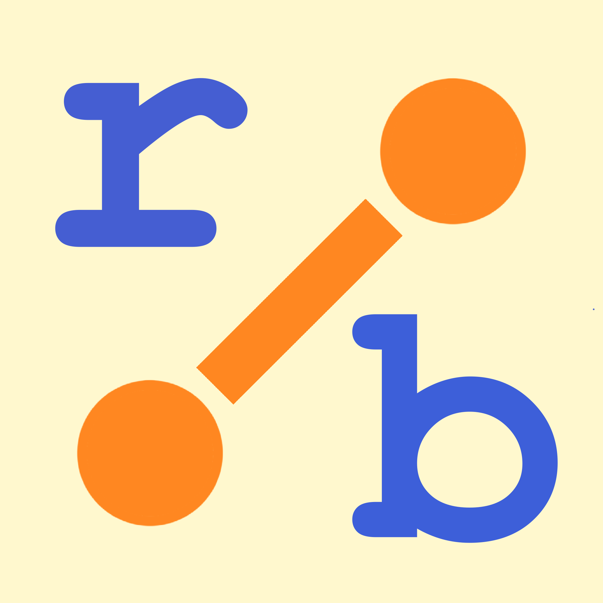

# Robo-Boy

[](https://github.com/tessel-la/robo-boy/actions/workflows/test.yml)
[](https://github.com/tessel-la/robo-boy/actions/workflows/docker-ci.yml)
[](https://codecov.io/gh/tessel-la/robo-boy)
[](https://github.com/tessel-la/robo-boy/tags)
[](https://github.com/tessel-la/robo-boy/blob/main/LICENSE)

<p align="center">
  
</p>

Robo-Boy is a web, desktop, and iPhone interface for controlling and visualizing ROS 2 robots. It includes camera streaming, configurable control pads, 3D visualization, behavior-tree editing, and custom themes. All three run the same React codebase; the desktop and iPhone packages are lightweight Tauri shells and connect to a separately installed ROS stack.

## Start With The App

The shortest route. The app needs only the ROS services, so there is no certificate to create and no
proxy to run.

1. Install a package for the current release:
   [`.deb`](https://github.com/tessel-la/robo-boy/releases/latest/download/Robo-Boy-linux-amd64.deb) ·
   [`.rpm`](https://github.com/tessel-la/robo-boy/releases/latest/download/Robo-Boy-linux-x86_64.rpm) ·
   [`.dmg`](https://github.com/tessel-la/robo-boy/releases/latest/download/Robo-Boy-macos-universal.dmg) ·
   [`.exe`](https://github.com/tessel-la/robo-boy/releases/latest/download/Robo-Boy-windows-x64-setup.exe) ·
   [`.ipa`](https://github.com/tessel-la/robo-boy/releases/latest/download/Robo-Boy-iphone-unsigned.ipa)

   The iPhone package is unsigned, because signing an iOS app needs an Apple account. Sign it with
   your own and sideload it: [iOS application](docs/ios.md).

2. Start the ROS services on the computer that runs ROS:

   ```bash
   git clone git@github.com:tessel-la/robo-boy.git
   cd robo-boy
   docker compose up -d --build ros-stack
   ```

3. Open the app. Use **Quick Connect** when ROS runs on the same computer, or the advanced options and **Host
   or IP** when it runs elsewhere, which on a phone it always is.

See [Application](docs/application.md) for the port contract and remote hosts.

## Start With Docker

Use this when Robo-Boy has to be opened in a browser, including from a phone or another computer. A browser
needs HTTPS before it grants a page a camera, and the app and the robot services have to share one origin;
Caddy and a locally trusted certificate supply both.


### Prerequisites

- Docker with Docker Compose
- [mkcert](https://github.com/FiloSottile/mkcert#installation)

### Run

```bash
git clone git@github.com:tessel-la/robo-boy.git
cd robo-boy
mkcert -install
mkdir -p infra/caddy/certs
mkcert -key-file infra/caddy/certs/local-key.pem -cert-file infra/caddy/certs/local-cert.pem localhost 127.0.0.1 ::1 YOUR_HOST_IP
docker compose up -d --build
```

Replace `YOUR_HOST_IP` with the computer's local network IP if Robo-Boy will be opened from another device.

Open `https://localhost`, or `https://YOUR_HOST_IP` from a device on the same network.

### Stop

```bash
docker compose down
```

## Documentation

See the [documentation index](docs/README.md) for application usage, desktop packaging, development commands, ROS workspace overlays, custom gamepads, and architecture.

## License

See [LICENSE](LICENSE).
