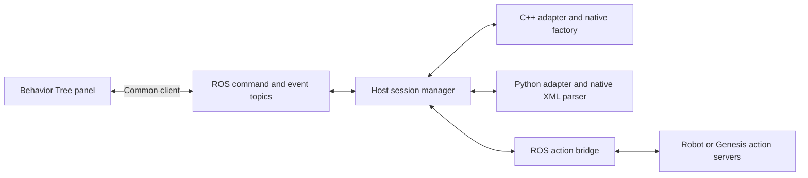

# Native Behavior Tree execution design

Research and design recorded before implementation, 30 September 2026.

## Current Robo Boy architecture

`BehaviorTreePanel.tsx` owns a React Flow graph, undo history, nested editor paths,
localStorage persistence and execution visualization. `types.ts` describes Robo
Boy's JSON graph; it is not either framework's native tree format. The browser
`engine/executor.ts` implements its own control flow and sends ROS calls with
ROSLIB. `engine/persistentExecutor.ts` optionally delegates that same JSON graph
to `infra/ros/behavior_tree_runner.py`. Protocol v1 uses command/status JSON in
`std_msgs/msg/String`; the runner dynamically imports overlay action types.
The recently merged execution store provides detailed action/service feedback.
ROS connections are supplied by the panel context and scoped to the selected
host. Existing JSON trees must remain compatible, without claiming either
native framework implements their semantics.

The ROS Docker entrypoint sources robot overlays and starts rosbridge and the
JSON runner. Available simulation integrations include Manipulator Sim and
Genesis. Genesis is a separate sibling repository (`genesis-manipulator-sim`).
Its physics/API owns action queues; `ros/genesis_ros_bridge.py` exposes standard
trajectory/gripper actions and custom detect/approach/grasp/release/pose actions.
There are currently five Robo Boy JSON examples, but no native BT runtime.
Its mock backend can validate the ROS/action integration deterministically;
its Genesis backend additionally exercises actual physics and GPU rendering.

## BehaviorTree.CPP

Current upstream is 4.10.0. `BehaviorTreeFactory` registers typed node builders
and trusted shared-library plugins, reads XML, and instantiates the selected
`BehaviorTree` with scoped blackboards. V4 documents use `<root
BTCPP_format="4" main_tree_to_execute="Main">`, `<BehaviorTree ID="Main">`,
registered node tags or `<Action ID="...">`/`<Condition ID="...">`, port attributes,
`{key}` remapping, `<SubTree ID="...">`, and optional `TreeNodesModel` metadata.
Factory validation is authoritative: the editor cannot infer registered ports.
Sequence, reactive sequence, fallback, decorators, parallel thresholds,
scripting and pre/postconditions retain their native behavior.

A tick enters IDLE nodes, can yield RUNNING, and eventually SUCCESS or FAILURE;
SKIPPED is also a native status and must remain visible in raw status metadata.
Stateful asynchronous actions implement `onStart`, `onRunning`, and `onHalted`.
Cancellation calls `haltTree`, never destroys a running tree first. Status
subscriptions observe transitions even within one tick. Native exceptions are
execution errors, distinct from a legitimate FAILURE result. Tree destruction
and blackboard reconstruction provide a clean reset/rerun.

BehaviorTree.CPP itself is middleware independent. BehaviorTree.ROS2 adds
rclcpp action/service/topic wrappers and a tree execution server. Those ROS2
interfaces are not interchangeable with py_trees_ros snapshot services. Robo
Boy needs its own small common host interface rather than coupling the panel
to either server's protocol. Trusted BT.CPP plugins may still supply native ROS2
nodes; the included `RosAction` node delegates dynamic ROS action messages to
the host's rclpy bridge, so Genesis interfaces do not need to be compiled into
Robo Boy's C++ executable.

## py_trees and py_trees_ros

Latest released py_trees is 2.6.0 (10 September 2026). The experimental native
XML/ports workflow arrived in 2.5.0 (13 July 2026), and 2.6 fixes types, defaults,
absolute ROS names and constant-vs-blackboard constructor arguments. Older ROS
distro packages cannot be assumed to include this workflow. Discovery must
probe `py_trees.parsers.behaviour_tree_xml` and report a missing parser clearly.

`parse_behaviour_tree_xml(file, main_tree_id, node_registry, ...)` reads
`root`/`BehaviorTree`/`SubTree`, imports/includes, constructor parameters and
ports. `PortsMixin`/`BehaviourWithPorts` classes register automatically when
imported; an explicit registry can restrict or inject trusted classes. Parsing
is construction, not execution. `BehaviourTree.setup` initializes resources;
`tick` uses `initialise`, `update`, `terminate`, and `shutdown`. INVALID maps to
panel idle; RUNNING, SUCCESS, FAILURE map directly. `stop(INVALID)` invalidates
running descendants and triggers asynchronous action cancellation. Feedback is
`feedback_message`; post-tick snapshots plus status observation preserve live
states. Native exceptions are errors, not FAILURE.

py_trees_ros owns ROS setup, action clients, subscriber behavior, snapshot
streams, blackboard exchange and shutdown. ROS behaviors require a node passed
to setup and an executor spinning their callbacks. Its action behavior cancels
on INVALID. The host worker supports py_trees_ros setup for trusted registered
ROS behaviors; the common `RosAction` ports behavior also uses the bridge, with
identical wire feedback/results to C++. No XML can request a Python import.

## Differences and preservation

| Concern | BehaviorTree.CPP | py_trees 2.6 XML |
| --- | --- | --- |
| Identifier | `BTCPP_format="4"` | no mandatory unique format marker |
| Registration | factory IDs, C++ ports, trusted plugins | Python classes/PortsMixin registry |
| Sequence | native Sequence / ReactiveSequence / SequenceWithMemory | `Sequence memory="true|false"` (default true) |
| Fallback | native Fallback / ReactiveFallback | Selector or Fallback with memory flag |
| Parallel | success/failure thresholds | `policy="success_on_all|success_on_one|success_on_selected"` |
| Remapping | typed scoped C++ blackboard, `_autoremap` | absolute Python keys, subtree namespaces, ports |
| Idle/cancel | IDLE, `haltTree` | INVALID, `stop(INVALID)` |
| Extras | scripting, preconditions, TreeNodesModel | constructor kwargs, ports defaults, Python decorators |

Similar syntax does **not** prove semantic equivalence. Explicit BTCPP_format
allows automatic identification. Distinctive Python composite attributes (`memory`,
`policy`) and Python built-ins also identify py_trees automatically; genuinely shared
marker-free syntax still requires a format selection.
The saved editor document stores original XML, runtime ID and main tree ID.
Layout/status graphs are projections, never serialized back into execution XML.
Native XML is edited through a persisted native definition graph or directly as source. The graph compiles into native XML; the runtime projection remains a view of host-owned execution.
Unknown constructs remain intact. Host native parsers validate registered nodes.
File includes/imports are rejected for remote uploads: native parsers otherwise
read arbitrary host paths. Self-contained documents support multiple subtrees;
users must inline includes explicitly. This restriction is an advertised
capability, never silent translation. DTDs/entities are rejected and uploads,
node counts and recursive subtree expansion are bounded.

## Common runtime abstraction and ownership

The frontend has a format adapter registry (identify/parse/project/preserve) and
one `RemoteTreeRuntime` transport/client. Discovery descriptors expose ID,
version, availability/reason, host-owned enabled state, node registrations and capabilities. The panel
uses one native runtime controller and canvas within the shared editor for both frameworks;
no backend-specific execution decisions belong in panel components.

The ROS host owns a serialized session manager, runtime adapters and supervised
native subprocesses. Both adapters implement discovery, loading/validation,
ticking, halting, resetting and node snapshots. C++ runs the real BT.CPP factory;
Python runs the real upstream XML parser and tree lifecycle. Neither emulates
control flow. Per-session processes isolate native crashes and Python global
blackboards. XML-triggered imports, shell commands and shared-library paths are
not accepted; trusted plugins are configured by the host operator.

One native execution slot prevents competing native trees from commanding the robot.
Commands carry request IDs; mutations also carry a session ID. Responses and
snapshots carry monotonic sequence numbers and a host boot ID. Clients ignore
stale/out-of-session data, time out requests and rediscover on reconnect. Load
is transactional: invalid replacement leaves the previously loaded tree intact.
Start is rejected during a run; cancel/stop halt descendants and ROS goals;
reset halts and reconstructs the original tree. A disconnected panel must not
claim remote cancellation succeeded. Execution is host-owned and survives a
browser closure; reconnect retrieves authoritative snapshots. Heartbeats expose
a vanished host runner separately from a disconnected rosbridge connection.

## ROS contract and discovery

New protocol v2 is separate from v1 for backwards compatibility:

* `/robo_boy/bt/command`: reliable `std_msgs/msg/String`, JSON requests.
* `/robo_boy/bt/events`: reliable `std_msgs/msg/String`, JSON responses, live
  node snapshots, feedback, action output, logs and terminal results.
* Commands: `discover`, `set_enabled`, `validate`, `load`, `start`, `stop`, `cancel`, `reset`,
  `status`. A bounded snapshot heartbeat enables runtime liveness detection.
* Request fields: `protocolVersion`, `requestId`, `command`, optional `runtime`,
  `xml`, `mainTreeId`, `sessionId`, `enabled` (boolean for `set_enabled`).
* Event fields: `protocolVersion`, `hostId`, `sequence`, `type`, optional
  `requestId`, `ok`, `error`, `runtimes`, `session` and `log`.
* Session: ID/runtime/original XML/main ID, run ID, lifecycle state, result/error and
  nodes with stable runtime IDs, parent IDs, native type/status and feedback.
  Last observed success/failure is retained separately from current status, since
  native controls can reset nodes to idle within a tick; reset clears it.
* Full source is included in command responses; tick snapshots carry node state
  and reuse the cached source for the same session.
* Registered `RosAction` leaves use `action_name`, `action_type`, JSON blackboard `goal` or literal `goal_b64`,
  bounded `timeout` seconds. Native RUNNING polls asynchronous ROS goals;
  terminal results and feedback are streamed. Halting cancels even goals whose
  acceptance races with cancellation.

Discovery interrogates executable startup and parser imports; merely finding a
ROS topic or package is insufficient. Both descriptors are always returned,
including unavailable reasons. Auto-selection follows the document's format
and never substitutes one backend when it is missing. Native node registration
and supported XML capabilities are published from the actual worker.

The shared document menu keeps JSON and XML file/folder loading, saved trees,
names and export consistent. Separate engine switches call `set_enabled` on the
host. Both default enabled; flags last until executor restart. Disabling halts
and releases that backend's worker while retaining the stopped session. Disabled
engines reject validation, loading, starting and reset, and are hidden from the toolbar selector. Documents retain their format and source when an engine is disabled; selecting an enabled engine never translates them. The shared panel's Run
loads changed source and resets terminal sessions automatically. Native source
editing and main-tree selection preserve framework-specific semantics.

The toolbar, menu and palette remain mounted across JSON/XML loads. The native
controller owns XML projection and remote lifecycle, while the canvas uses the
same React Flow layout and node styling as the JSON editor. The engine selector
chooses a library and never translates source. Execution requires a compatible,
available and enabled engine. The palette provides subtree composition and definition
browsing without changing the execution entrypoint. Original XML and per-node
ports/status/feedback live in on-demand canvas inspectors; no permanent log panel
or separate XML workspace replaces the editor. Worker snapshots carry native
port remappings, including py_trees namespaced keys. Registered JsonGet/JsonSet
leaves in both workers connect ROS JSON results to subsequent action goals.
Python redirects the process stdout descriptor to stderr and keeps IPC on a
dedicated duplicate descriptor so C-level ROS logs cannot corrupt messages.

Folder imports use local File APIs and list filenames with their relative directories and format. GitHub fetching is removed. Opening replaces the document; Add imports XML definitions for composition. Runtime status is a human-readable pill beside Run. Run loads automatically, Check tree validates without execution, and opening a different host tree is an explicit menu action. The canvas has subtree navigation above the graph and error messages, without host loading/recovery controls at the bottom.

### Stable native canvas projection

The source projection owns instance addresses and navigable, collapsed definition views.
The common projection binds a matching session's native topology in child order, using
`TreeFormatAdapter.subtreeTopology`: C++ keeps its native SubTree wrapper; Python
aliases the inlined definition root. Names and labels never identify instances. Repeated
and nested references each get their own view. A topology mismatch disables the state
binding and reports an error rather than attributing a native state to the wrong source node.
This is a visualization mapping only; neither backend's executable tree is altered.

The native canvas owns a separate React Flow store, measured layout, and viewport.
Ticks update data while retaining positions and dimensions. Node status rows reserve
space, so transitions do not change geometry. Fit occurs after the new view is measured
and painted, on explicit Arrange and container resize, never on tick state changes.
User navigation disables Follow, and execution never enters or leaves a subtree view.

### Native authoring and subtree libraries

Native trees need an editable definition graph, including disconnected drafts, rather
than only a runtime projection. The native document retains its original XML as the
metadata/template source and optionally stores a versioned editor graph with stable
node IDs, child ordering and positions. XML serialization uses the original elements,
attributes, text/comments and document metadata; execution still uses each native parser.
Disconnected or incomplete graphs can be saved as drafts but cannot load, run or export
executable XML. Source editing explicitly replaces the visual draft.

Format adapters own native control/decorator arity and constructor defaults. The common
editor owns insertion, connections, cycle prevention, ordering, removal, attributes,
layout and history. Registered custom nodes retain host-defined semantics and receive
native validation before execution. Editing locks while the host runs a tree.

Opening a repository file replaces the active document; importing its subtree library
adds its definitions and metadata to the active document instead. Imports are atomic,
include nested dependencies, reject incompatible engines, and reject conflicting IDs.
An explicit user-supplied prefix can rename imported definitions and their SubTree
references. This is never an automatic format translation; Python subtree namespaces
may change when definition IDs are renamed. Imported libraries become draggable
palette entries, with a separate action to inspect a definition.

## Validation plan

Test both native factories/parsers (invalid/unsupported XML, metadata, subtrees,
backend-specific semantics), lifecycle (RUNNING, success, failure, exceptions,
halt, reset/rerun), manager correlation/concurrency and unavailable runtimes.
Test client synchronization, stale sessions, timeout/disconnection/reconnect,
XML preservation and panel controls. Run real ROS/rosbridge integration using
Genesis action servers with equivalent XML examples for each backend. Package
a reproducible Genesis mock stack for machines without a GPU; document actual
physics validation separately if the GPU simulation cannot run here.

## Sources reviewed

* [BT.CPP latest source and release notes](https://github.com/BehaviorTree/BehaviorTree.CPP)
* [BT.CPP XML and subtree ports](https://www.behaviortree.dev/docs/tutorial-basics/tutorial_06_subtree_ports)
* [BT.CPP asynchronous actions](https://www.behaviortree.dev/docs/tutorial-basics/tutorial_04_sequence)
* [BehaviorTree.ROS2](https://github.com/BehaviorTree/BehaviorTree.ROS2)
* [py_trees 2.6 release notes](https://github.com/splintered-reality/py_trees/blob/2.6.0/CHANGELOG.rst)
* [py_trees XML parser](https://github.com/splintered-reality/py_trees/blob/2.6.0/py_trees/parsers/behaviour_tree_xml.py)
* [py_trees XML demo](https://github.com/splintered-reality/py_trees/blob/2.6.0/py_trees/demos/ports/xml_tree.xml)
* [py_trees lifecycle](https://py-trees.readthedocs.io/en/devel/behaviours.html)
* [py_trees_ros tree setup/action clients](https://github.com/splintered-reality/py_trees_ros)
